# Trading 212 Reports Database - Diagrama ER (Entity-Relationship)

## 📊 Diagrama Mermaid (copiar e colar em https://mermaid.live)

```mermaid
erDiagram
    REPORT_FILES ||--o{ REPORT_BALANCE_SUMMARY : contains
    REPORT_FILES ||--o{ REPORT_TRANSACTIONS : contains
    REPORT_FILES ||--o{ REPORT_POSITIONS : contains
    REPORT_FILES ||--o{ REPORT_DIVIDENDS : contains
    REPORT_FILES ||--o{ REPORT_CASH_MOVEMENTS : contains
    REPORT_FILES ||--o{ REPORT_COSTS : contains
    REPORT_FILES ||--o{ REPORT_REALIZED_PNL : contains
    REPORT_FILES ||--o{ REPORT_CORPORATE_ACTIONS : contains
    REPORT_FILES ||--o{ REPORT_TAX_SUMMARY : contains
    REPORT_FILES ||--o{ REPORT_METADATA : contains
    REPORT_FILES ||--o{ REPORT_IMPORT_LOG : contains
    REPORT_FILES ||--o{ REPORT_VALIDATION_CHECKS : contains

    REPORT_FILES {
        uuid id PK
        string filename UK
        string file_hash
        string report_type
        date period_start
        date period_end
        string account_holder_name
        string account_number
        string account_type
        int total_transactions
        timestamp created_at
        timestamp updated_at
        string imported_by
        string import_status
    }

    REPORT_BALANCE_SUMMARY {
        uuid id PK
        uuid report_file_id FK
        date report_date
        date period_start
        date period_end
        decimal beginning_balance
        decimal ending_balance
        decimal total_deposits
        decimal total_withdrawals
        decimal total_interest
        decimal total_commission
        decimal net_cash_flow
        decimal net_pnl
        timestamp created_at
        timestamp updated_at
    }

    REPORT_TRANSACTIONS {
        uuid id PK
        uuid report_file_id FK
        date transaction_date
        string transaction_type
        string order_id
        string isin
        string ticker
        string instrument_name
        decimal quantity
        decimal unit_price
        decimal gross_amount
        decimal commission
        decimal net_amount
        string currency
        decimal cash_balance_after
        timestamp created_at
        timestamp updated_at
    }

    REPORT_POSITIONS {
        uuid id PK
        uuid report_file_id FK
        date position_date
        string isin UK
        string ticker
        string instrument_name
        decimal quantity
        decimal cost_basis_per_unit
        decimal total_cost_value
        decimal market_price_per_unit
        decimal total_market_value
        decimal unrealised_pnl
        decimal unrealised_pnl_percentage
        string currency
        timestamp created_at
        timestamp updated_at
    }

    REPORT_DIVIDENDS {
        uuid id PK
        uuid report_file_id FK
        date ex_date
        date payment_date
        string isin
        string ticker
        string instrument_name
        decimal quantity_held
        decimal dividend_per_share
        decimal total_dividend
        string currency
        timestamp created_at
        timestamp updated_at
    }

    REPORT_CASH_MOVEMENTS {
        uuid id PK
        uuid report_file_id FK
        date movement_date
        string movement_type
        decimal amount
        string description
        string reference
        string currency
        timestamp created_at
        timestamp updated_at
    }

    REPORT_COSTS {
        uuid id PK
        uuid report_file_id FK
        date cost_date
        string cost_type
        string isin
        string ticker
        string instrument_name
        decimal amount
        string description
        string currency
        timestamp created_at
        timestamp updated_at
    }

    REPORT_REALIZED_PNL {
        uuid id PK
        uuid report_file_id FK
        date sale_date
        string isin
        string ticker
        string instrument_name
        decimal quantity_sold
        decimal average_purchase_price
        decimal sale_price
        decimal total_cost
        decimal total_proceeds
        decimal gross_gain_loss
        decimal commission
        decimal net_gain_loss
        decimal gain_loss_percentage
        string currency
        timestamp created_at
        timestamp updated_at
    }

    REPORT_CORPORATE_ACTIONS {
        uuid id PK
        uuid report_file_id FK
        date action_date
        string isin
        string ticker
        string instrument_name
        string action_type
        decimal quantity_before
        decimal quantity_after
        string ratio
        string description
        timestamp created_at
        timestamp updated_at
    }

    REPORT_TAX_SUMMARY {
        uuid id PK
        uuid report_file_id FK
        int tax_year
        decimal total_realized_gains
        decimal total_realized_losses
        decimal net_realized_gain_loss
        decimal loss_carryforward_previous
        decimal loss_carryforward_current
        decimal total_dividend_income
        decimal total_interest_income
        decimal total_other_income
        decimal total_withholding_tax
        text notes
        timestamp created_at
        timestamp updated_at
    }

    REPORT_METADATA {
        uuid id PK
        uuid report_file_id FK
        int page_count
        int total_lines
        string encoding
        boolean has_discrepancies
        text discrepancy_notes
        text general_notes
        text extraction_warnings
        timestamp created_at
        timestamp updated_at
    }

    REPORT_IMPORT_LOG {
        uuid id PK
        uuid report_file_id FK
        timestamp import_timestamp
        string status
        int records_imported
        int records_skipped
        text error_message
        decimal duration_seconds
    }

    REPORT_VALIDATION_CHECKS {
        uuid id PK
        uuid report_file_id FK
        string check_type
        string check_description
        string expected_value
        string actual_value
        boolean passed
        text error_details
        timestamp checked_at
    }
```



---

## 📐 Diagrama Textual (Estrutura Hierárquica)

```
┌─────────────────────────────────────────────────────────────────────┐
│                     REPORT_FILES (Raiz)                             │
│  • id (UUID, PK)                                                    │
│  • filename (UNIQUE)                                                │
│  • report_type: annual | monthly | interval                         │
│  • period_start, period_end                                         │
│  • account_holder_name, account_number, account_type               │
│  • created_at, updated_at                                           │
└────┬───────────────────────────────────────────────────────────────┘
     │
     ├─── 1:1 ──► REPORT_BALANCE_SUMMARY
     │            • beginning_balance, ending_balance
     │            • total_deposits, total_withdrawals
     │            • net_cash_flow, net_pnl
     │
     ├─── 1:N ──► REPORT_TRANSACTIONS
     │            • transaction_date, transaction_type
     │            • isin, ticker, instrument_name
     │            • quantity, unit_price
     │            • gross_amount, commission, net_amount
     │            • cash_balance_after
     │
     ├─── 1:N ──► REPORT_POSITIONS
     │            • position_date (date/time do snapshot)
     │            • isin (UNIQUE per report_file + position_date)
     │            • quantity
     │            • cost_basis_per_unit, total_cost_value
     │            • market_price_per_unit, total_market_value
     │            • unrealised_pnl, unrealised_pnl_percentage
     │
     ├─── 1:N ──► REPORT_DIVIDENDS
     │            • ex_date, payment_date
     │            • isin, ticker, instrument_name
     │            • quantity_held, dividend_per_share
     │            • total_dividend
     │
     ├─── 1:N ──► REPORT_CASH_MOVEMENTS
     │            • movement_date
     │            • movement_type: deposit | withdrawal | interest | fee
     │            • amount (signed: + entrada, - saída)
     │            • description, reference
     │
     ├─── 1:N ──► REPORT_COSTS
     │            • cost_date
     │            • cost_type: commission | trading_fee | tax | etc
     │            • isin (NULL se custo geral)
     │            • amount
     │
     ├─── 1:N ──► REPORT_REALIZED_PNL
     │            • sale_date
     │            • isin, quantity_sold
     │            • average_purchase_price, sale_price
     │            • total_cost, total_proceeds
     │            • gross_gain_loss, commission, net_gain_loss
     │
     ├─── 1:N ──► REPORT_CORPORATE_ACTIONS
     │            • action_date
     │            • action_type: stock_split | reverse_split | etc
     │            • quantity_before, quantity_after
     │            • ratio
     │
     ├─── 1:1 ──► REPORT_TAX_SUMMARY (apenas Anual)
     │            • tax_year
     │            • total_realized_gains, total_realized_losses
     │            • loss_carryforward_previous, loss_carryforward_current
     │            • dividend_income, interest_income
     │            • withholding_tax
     │
     ├─── 1:1 ──► REPORT_METADATA
     │            • page_count, total_lines
     │            • has_discrepancies, discrepancy_notes
     │            • extraction_warnings
     │
     ├─── 1:N ──► REPORT_IMPORT_LOG
     │            • import_timestamp
     │            • status: started | completed | failed | partial
     │            • records_imported, records_skipped
     │            • duration_seconds
     │
     └─── 1:N ──► REPORT_VALIDATION_CHECKS
                  • check_type
                  • expected_value, actual_value
                  • passed (boolean)
                  • error_details
```

---

## 🔑 Relacionamentos Principais

### Relacionamento Central: REPORT_FILES → *

| Tabela | Tipo | Cardinalidade | Descrição |
|--------|------|---------------|-----------|
| **REPORT_BALANCE_SUMMARY** | 1:1 | Um ficheiro tem um resumo de saldo | Totais do período |
| **REPORT_TRANSACTIONS** | 1:N | Um ficheiro tem N transações | Compras, vendas, dividendos, etc |
| **REPORT_POSITIONS** | 1:N | Um ficheiro tem N posições | Snapshot de posições no fim do período |
| **REPORT_DIVIDENDS** | 1:N | Um ficheiro pode ter N dividendos | Rendimentos recebidos |
| **REPORT_CASH_MOVEMENTS** | 1:N | Um ficheiro tem N movimentações | Depósitos, levantamentos, juros |
| **REPORT_COSTS** | 1:N | Um ficheiro tem N custos | Comissões, taxas |
| **REPORT_REALIZED_PNL** | 1:N | Um ficheiro tem N vendas c/ P&L | Ganhos/perdas realizadas |
| **REPORT_CORPORATE_ACTIONS** | 1:N | Um ficheiro pode ter ações corporativas | Splits, mergers, etc |
| **REPORT_TAX_SUMMARY** | 1:1 | Um ficheiro tem um sumário fiscal | Apenas em Anuais |
| **REPORT_METADATA** | 1:1 | Um ficheiro tem metadata | Info técnica + validação |
| **REPORT_IMPORT_LOG** | 1:N | Histórico de importações | Track de quando foi importado |
| **REPORT_VALIDATION_CHECKS** | 1:N | Resultados de validações | Verificação de integridade |

---

## 🔗 Chaves Estrangeiras

```
REPORT_FILES (PK: id)
    ↓
    ├─ REPORT_BALANCE_SUMMARY (FK: report_file_id → REPORT_FILES.id)
    ├─ REPORT_TRANSACTIONS (FK: report_file_id → REPORT_FILES.id)
    ├─ REPORT_POSITIONS (FK: report_file_id → REPORT_FILES.id)
    ├─ REPORT_DIVIDENDS (FK: report_file_id → REPORT_FILES.id)
    ├─ REPORT_CASH_MOVEMENTS (FK: report_file_id → REPORT_FILES.id)
    ├─ REPORT_COSTS (FK: report_file_id → REPORT_FILES.id)
    ├─ REPORT_REALIZED_PNL (FK: report_file_id → REPORT_FILES.id)
    ├─ REPORT_CORPORATE_ACTIONS (FK: report_file_id → REPORT_FILES.id)
    ├─ REPORT_TAX_SUMMARY (FK: report_file_id → REPORT_FILES.id)
    ├─ REPORT_METADATA (FK: report_file_id → REPORT_FILES.id)
    ├─ REPORT_IMPORT_LOG (FK: report_file_id → REPORT_FILES.id)
    └─ REPORT_VALIDATION_CHECKS (FK: report_file_id → REPORT_FILES.id)
```

**Ação em DELETE:** Cascata (`ON DELETE CASCADE`) - Se um ficheiro for apagado, todos os seus registos relacionados são também apagados.

---

## 📋 Índices Criados para Performance

### Índices em REPORT_FILES
- `idx_report_files_period` → (period_start, period_end) - Queries por período
- `idx_report_files_type` → (report_type) - Filtrar Anual/Mensal/Intervalo
- `idx_report_files_status` → (import_status) - Queries de status

### Índices em REPORT_TRANSACTIONS
- `idx_transactions_report` → (report_file_id) - Todas as transações de um ficheiro
- `idx_transactions_date` → (transaction_date) - Queries por data
- `idx_transactions_type` → (transaction_type) - Filtrar BUY/SELL/etc
- `idx_transactions_isin` → (isin) - Queries por instrumento
- `idx_transactions_order_id` → (order_id) - Lookup de ordem específica

### Índices em REPORT_POSITIONS
- `idx_positions_report` → (report_file_id)
- `idx_positions_date` → (position_date)
- `idx_positions_isin` → (isin)
- `UNIQUE idx_positions_unique` → (report_file_id, position_date, isin) - Garante 1 posição por instrumento por data

### Índices em outras tabelas
- Cada tabela tem índice em `report_file_id` para filtros rápidos
- Tabelas com datas têm índices nas colunas de data
- Tabelas com tipos têm índices nas colunas de tipo

---

## 🗄️ Views Úteis

### `v_transaction_summary`
Resume transações por tipo, com contagem e totais:
```sql
SELECT * FROM v_transaction_summary
WHERE report_file_id = 'uuid-do-ficheiro'
```

### `v_final_positions_by_report`
Posições finais (portfolio snapshot) de cada relatório:
```sql
SELECT * FROM v_final_positions_by_report
WHERE position_date = '2025-12-31'
```

### `v_pnl_by_period`
Consolidado de P&L (realizado + não realizado) por período:
```sql
SELECT * FROM v_pnl_by_period
WHERE period_start >= '2025-01-01'
```

---

## 💾 Dimensões da BD

### Estimativa de Crescimento (por ano completo)

| Tabela | Registos/Ano | Tamanho Aprox |
|--------|-------------|---------------|
| **REPORT_FILES** | 3-12 | <1 MB |
| **REPORT_TRANSACTIONS** | 500-2000 | 5-10 MB |
| **REPORT_POSITIONS** | 20-50 | <1 MB |
| **REPORT_CASH_MOVEMENTS** | 12-50 | <1 MB |
| **REPORT_COSTS** | 10-50 | <1 MB |
| **REPORT_REALIZED_PNL** | 10-100 | <1 MB |
| **REPORT_DIVIDENDS** | 5-30 | <1 MB |
| **REPORT_CORPORATE_ACTIONS** | 0-5 | <1 MB |
| **REPORT_TAX_SUMMARY** | 1 | <1 MB |
| **REPORT_IMPORT_LOG** | 3-12 | <1 MB |
| **Total Estimado** | ~650-2300 | **10-20 MB/ano** |

**Conclusão:** Crescimento linear e pequeno. Sem necessidade de particionamento para 5-10 anos de dados.

---

## 🔐 Segurança & Conformidade

### Proteção de Dados
- ✅ Todos os IDs são UUIDs (não sequenciais, harder to guess)
- ✅ `created_at` + `updated_at` em todas as tabelas (auditoria)
- ✅ `report_file_id` em todas as tabelas (rastreabilidade 100%)
- ✅ Cascata de DELETE garante integridade referencial

### Row-Level Security (RLS) - Quando Integrado com Supabase
```sql
-- Exemplo de RLS para user_id (quando adicionado)
ALTER TABLE report_files ENABLE ROW LEVEL SECURITY;

CREATE POLICY "Users can view their own reports"
ON report_files
FOR SELECT
USING (auth.uid()::text = owner_user_id);
```

---

## 🔄 Fluxo de Dados na Importação

```
1. Upload PDF
   ↓
2. Parse PDF → Extract Data
   ↓
3. Insert INTO report_files (cria UUID do ficheiro)
   ↓
4. Insert INTO report_balance_summary (1 registo)
   ↓
5. Insert INTO report_transactions (N registos)
   ↓
6. Insert INTO report_positions (N registos)
   ↓
7. Insert INTO report_dividends (N registos)
   ↓
8. Insert INTO report_cash_movements (N registos)
   ↓
9. Insert INTO report_costs (N registos)
   ↓
10. Insert INTO report_realized_pnl (N registos)
   ↓
11. Insert INTO report_corporate_actions (N registos, se aplicável)
   ↓
12. Insert INTO report_tax_summary (1 registo, se Anual)
   ↓
13. Insert INTO report_metadata
   ↓
14. Insert INTO report_import_log (marca como completo)
   ↓
15. Run report_validation_checks
   ↓
16. ✅ Ficheiro Importado com Sucesso
```

---

## 📝 Exemplos de Queries

### Obter Todas as Transações de um Ficheiro
```sql
SELECT * FROM report_transactions
WHERE report_file_id = '550e8400-e29b-41d4-a716-446655440000'
ORDER BY transaction_date DESC;
```

### Portfolio Atual (Posições Finais)
```sql
SELECT
    rp.isin,
    rp.ticker,
    rp.instrument_name,
    rp.quantity,
    rp.total_market_value,
    rp.unrealised_pnl,
    rp.unrealised_pnl_percentage
FROM report_positions rp
WHERE rp.report_file_id = (
    SELECT id FROM report_files
    WHERE report_type = 'monthly'
    ORDER BY period_end DESC
    LIMIT 1
)
ORDER BY rp.total_market_value DESC;
```

### P&L Realizado por Ano
```sql
SELECT
    tax_year,
    total_realized_gains,
    total_realized_losses,
    net_realized_gain_loss
FROM report_tax_summary
ORDER BY tax_year DESC;
```

### Fluxo de Cash Total por Período
```sql
SELECT
    rf.period_start,
    rf.period_end,
    rbs.total_deposits,
    rbs.total_withdrawals,
    rbs.net_cash_flow,
    rbs.beginning_balance,
    rbs.ending_balance
FROM report_files rf
JOIN report_balance_summary rbs ON rf.id = rbs.report_file_id
WHERE rf.report_type IN ('monthly', 'annual')
ORDER BY rf.period_start;
```

### Transações com Maiores Comissões
```sql
SELECT
    transaction_date,
    transaction_type,
    isin,
    instrument_name,
    quantity,
    commission,
    net_amount
FROM report_transactions
WHERE commission > 0
ORDER BY commission DESC
LIMIT 20;
```

---

## ✅ Checklist de Implementação

- [ ] Criar schema em Supabase
- [ ] Ativar RLS em todas as tabelas
- [ ] Criar índices para performance
- [ ] Criar views
- [ ] Implementar parser PDF → SQL INSERT
- [ ] Implementar validações (import_log, validation_checks)
- [ ] Testar com os 3 PDFs fornecidos
- [ ] Implementar API endpoints (GET /reports, etc)
- [ ] Criar dashboard de visualização
- [ ] Setup backup automático

