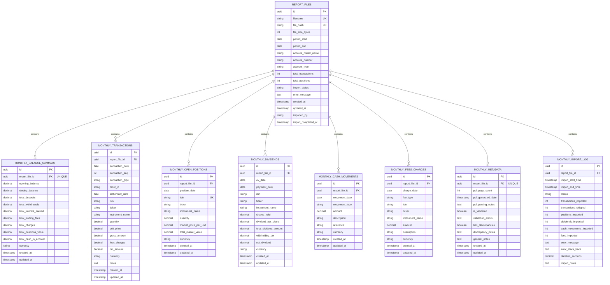

# Diagrama ER - Trading 212 Monthly Reports Database

## 📊 Diagrama Mermaid (copiar para https://mermaid.live)



---

## 📐 Diagrama Textual (ASCII Art)

```
╔═══════════════════════════════════════════════════════════════════════════╗
║                        REPORT_FILES (Raiz)                               ║
║                                                                           ║
║  id (UUID PK) | filename | file_hash | period_start | period_end         ║
║  account_holder_name | account_number | account_type                    ║
║  total_transactions | total_positions | import_status                   ║
║  created_at | updated_at | imported_by                                   ║
╚═══════════════════════════════════════════════════════════════════════════╝
                            │
        ┌───────────────────┼───────────────────┐
        │                   │                   │
   1:1  │                1:N│                 1:N│
        ▼                   ▼                   ▼
    ┌────────────┐   ┌─────────────────┐   ┌──────────────┐
    │  BALANCE   │   │  TRANSACTIONS   │   │ OPEN_        │
    │  SUMMARY   │   │                 │   │ POSITIONS    │
    │            │   │ • Date          │   │              │
    │ • Opening  │   │ • Type (BUY,    │   │ • ISIN       │
    │   Balance  │   │   SELL, DIV,    │   │ • Quantity   │
    │ • Closing  │   │   DEP, etc)     │   │ • Market Val │
    │   Balance  │   │ • ISIN/Ticker   │   │              │
    │ • Deposits │   │ • Quantity      │   └──────────────┘
    │ • Withdraw │   │ • Price         │
    │ • Interest │   │ • Gross/Net Amt │
    │ • Fees     │   │ • Commission    │
    │            │   │                 │
    └────────────┘   └─────────────────┘
                            │
                ┌───────────┼───────────┐
                │           │           │
             1:N│        1:N│        1:N│
                ▼           ▼           ▼
           ┌─────────┐  ┌──────────┐  ┌──────────┐
           │DIVIDENDS│  │   CASH   │  │   FEES   │
           │         │  │ MOVEMENTS│  │ CHARGES  │
           │• ex_date│  │          │  │          │
           │• payment│  │ • DEPOSIT│  │ • Type   │
           │• amount │  │ • WITH   │  │ • Amount │
           │• per_   │  │ • INTERE │  │ • Type   │
           │  share  │  │ • FEE    │  │          │
           └─────────┘  └──────────┘  └──────────┘

        ┌──────────────────┬──────────────────┐
        │                  │                  │
     1:1│               1:N│
        ▼                  ▼
    ┌─────────────┐   ┌──────────────┐
    │  METADATA   │   │ IMPORT_LOG   │
    │             │   │              │
    │ • Pages     │   │ • Start time │
    │ • Generated │   │ • End time   │
    │ • Validated │   │ • Status     │
    │ • Errors    │   │ • Counters   │
    │ • Discrep   │   │ • Duration   │
    └─────────────┘   └──────────────┘
```

---

## 🔗 Cardinalidades

| Relacionamento | Tipo | Descrição |
|---|---|---|
| REPORT_FILES → MONTHLY_BALANCE_SUMMARY | **1:1** | Um ficheiro tem exatamente um resumo de saldo |
| REPORT_FILES → MONTHLY_TRANSACTIONS | **1:N** | Um ficheiro tem múltiplas transações |
| REPORT_FILES → MONTHLY_OPEN_POSITIONS | **1:N** | Um ficheiro tem múltiplas posições |
| REPORT_FILES → MONTHLY_DIVIDENDS | **1:N** | Um ficheiro pode ter 0 ou mais dividendos |
| REPORT_FILES → MONTHLY_CASH_MOVEMENTS | **1:N** | Um ficheiro tem múltiplos movimentos de cash |
| REPORT_FILES → MONTHLY_FEES_CHARGES | **1:N** | Um ficheiro pode ter 0 ou mais taxas |
| REPORT_FILES → MONTHLY_METADATA | **1:1** | Um ficheiro tem um registo de metadata |
| REPORT_FILES → MONTHLY_IMPORT_LOG | **1:N** | Um ficheiro pode ter múltiplos registos de importação |

---

## 📌 Constraints Principais

### UNIQUE Constraints
```sql
REPORT_FILES.filename          -- Cada ficheiro tem nome único
REPORT_FILES.file_hash         -- Hash único (detetar duplicatas)
MONTHLY_BALANCE_SUMMARY.report_file_id    -- Um resumo por ficheiro
MONTHLY_OPEN_POSITIONS.(report_file_id, isin)  -- Uma posição por ISIN por ficheiro
MONTHLY_METADATA.report_file_id           -- Um metadata por ficheiro
```

### NOT NULL Constraints
```
Sempre obrigatório:
  - report_file_id (FK em todas as tabelas)
  - Datas (transaction_date, movement_date, etc)
  - Tipos (transaction_type, movement_type, fee_type)
  - Valores principais (amount, quantity, total_market_value)
  - created_at, updated_at (em todas as tabelas)
```

### CHECK Constraints
```sql
REPORT_FILES.import_status IN ('pending', 'processing', 'completed', 'error')
MONTHLY_TRANSACTIONS.transaction_type IN ('BUY', 'SELL', 'DIVIDEND', ...)
MONTHLY_CASH_MOVEMENTS.movement_type IN ('DEPOSIT', 'WITHDRAWAL', 'INTEREST', 'FEE')
MONTHLY_FEES_CHARGES.fee_type IN ('TRADING_COMMISSION', 'PLATFORM_FEE', ...)
```

---

## 🎯 Fluxo de Dados na Importação

```
1. Upload PDF Mensal
   └─ Validar ficheiro (nome, tamanho, hash)
   
2. INSERT INTO report_files
   └─ Cria UUID único do ficheiro
   
3. Parse PDF e Extract Data
   ├─ Section 1: Account Summary
   ├─ Section 2: Recent Activity
   ├─ Section 3: Open Positions
   ├─ Section 4: Fees & Charges
   └─ ...
   
4. INSERT INTO monthly_balance_summary
   └─ 1 registo (opening_balance, closing_balance, etc)
   
5. INSERT INTO monthly_transactions
   └─ N registos (BUY, SELL, DIVIDEND, DEPOSIT, etc)
   
6. INSERT INTO monthly_open_positions
   └─ N registos (ISIN + Quantity + Market Value)
   
7. INSERT INTO monthly_dividends
   └─ N registos (se houver dividendos)
   
8. INSERT INTO monthly_cash_movements
   └─ N registos (DEPOSIT, WITHDRAWAL, INTEREST, FEE)
   
9. INSERT INTO monthly_fees_charges
   └─ N registos (se houver taxas específicas)
   
10. INSERT INTO monthly_metadata
    └─ 1 registo (page_count, validation status, etc)
    
11. INSERT INTO monthly_import_log
    └─ 1 registo (status: COMPLETED, contadores, etc)
    
12. ✅ Relatório Importado com Sucesso!
```

---

## 📊 Exemplo Completo: Ficheiro Mensal Junho 2026

```
report_files:
  id: 550e8400-e29b-41d4-a716-446655440000
  filename: Activity-Statement-2026-06-01-2026-06-30.pdf
  period_start: 2026-06-01
  period_end: 2026-06-30
  total_transactions: 47
  total_positions: 8

monthly_balance_summary:
  report_file_id: 550e8400-e29b-41d4-a716-446655440000
  opening_balance: 5000.00
  closing_balance: 5250.75
  total_deposits: 1000.00
  total_withdrawals: 500.00
  total_interest_earned: 12.50
  total_trading_fees: 75.00

monthly_transactions:
  [47 registos]
  - 2026-06-05 BUY IE00B4L5Y983 10 @ €150 = €1500 - €2.50 comissão
  - 2026-06-10 DIVIDEND IE00B4L5Y983 €25
  - 2026-06-15 SELL US0846707026 2 @ €300 = €600 - €1.50 comissão
  - 2026-06-20 DEPOSIT €500
  - ...

monthly_open_positions:
  [8 registos]
  - IE00B4L5Y983 Vanguard FTSE All-World 14.840 @ €166.22 = €2,467.42
  - US0846707026 Berkshire Hathaway 0.100 @ €318.90 = €31.89
  - ...

monthly_dividends:
  [3 registos]
  - 2026-06-10 IE00B4L5Y983 10 shares × €2.50 = €25.00

monthly_cash_movements:
  - 2026-06-01 DEPOSIT €500
  - 2026-06-15 INTEREST €12.50
  - 2026-06-20 WITHDRAWAL €100

monthly_fees_charges:
  - 2026-06-05 TRADING_COMMISSION €2.50
  - 2026-06-15 TRADING_COMMISSION €1.50
  - ...
```

